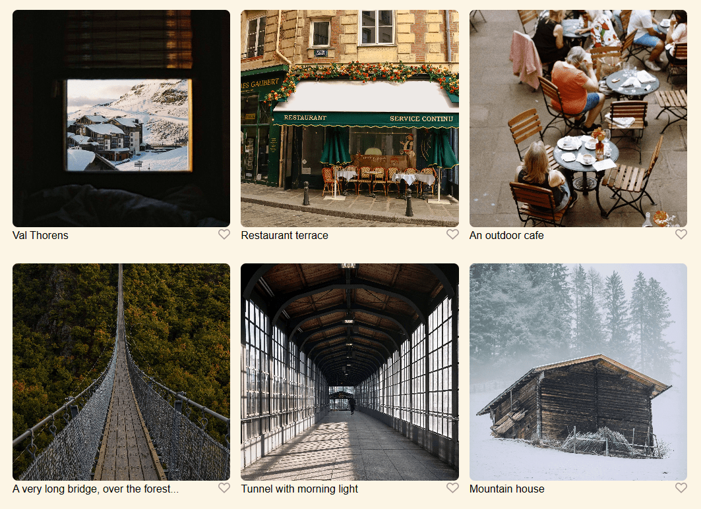
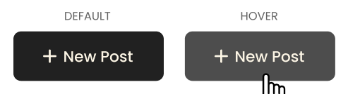
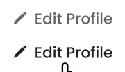
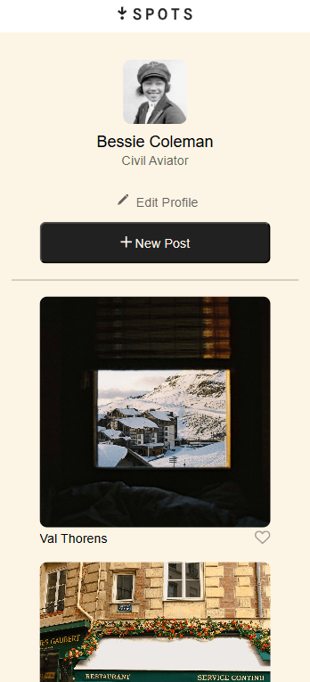

# Spots : Social Media Web Application

### Overview  

* Intro  
* Technologies & Techniques Utilized
* Link to the Site
* Link to Video Overview
* Link to Project Brief
  
**Intro**
  
The Spots landing page is a component of a social media web application. The application allows users to create a profile and upload images to share with others. Users have the opportunity to add titles to their photos before uploading.

**Technologies & Techniques Utilized**

* **Flexbox**

The flex property is generously used throughout the layout of this design. It can be seen in every section of the page. The profile provides a look into how flexboxes can be placed inside of one another.

* **Grid**
 
The gallery seen on the page was created by displaying an untitled list with the grid property.

* **Hover animations**

There are three hover animations with smooth transitions and cursor effects applied on the page: the edit profile button, the new post button, and the like button.

*Screenshots below were taken from the original Figma project breif.*

* **Responsive web layout**

The page is responsive using flexable sizing measurments and media queries. The layout of the profile and image sizes adjust to accomadate smaller screen sizes.

* **Update**
Users are able to upload their own images and change their profile name and description. All forms also go through a validation process, allowing for more accurate and functional submissions.
  

**Site Link**  
  
[View the site on Github pages](https://acozycoder.github.io/se_project_spots/)

**Link to Video Overview**

[View the Video Overview](https://drive.google.com/file/d/11YzYCQaZwQy8TLnvG1MYOh4vG3XXH5X3/view?usp=sharing)

**Link to Project Brief**

[Project Brief](https://www.figma.com/design/BBNm2bC3lj8QQMHlnqRsga/Sprint-3-Project%3A-Spots?node-id=2-60&t=dhx4a7QVO8K6z6pP-0)
